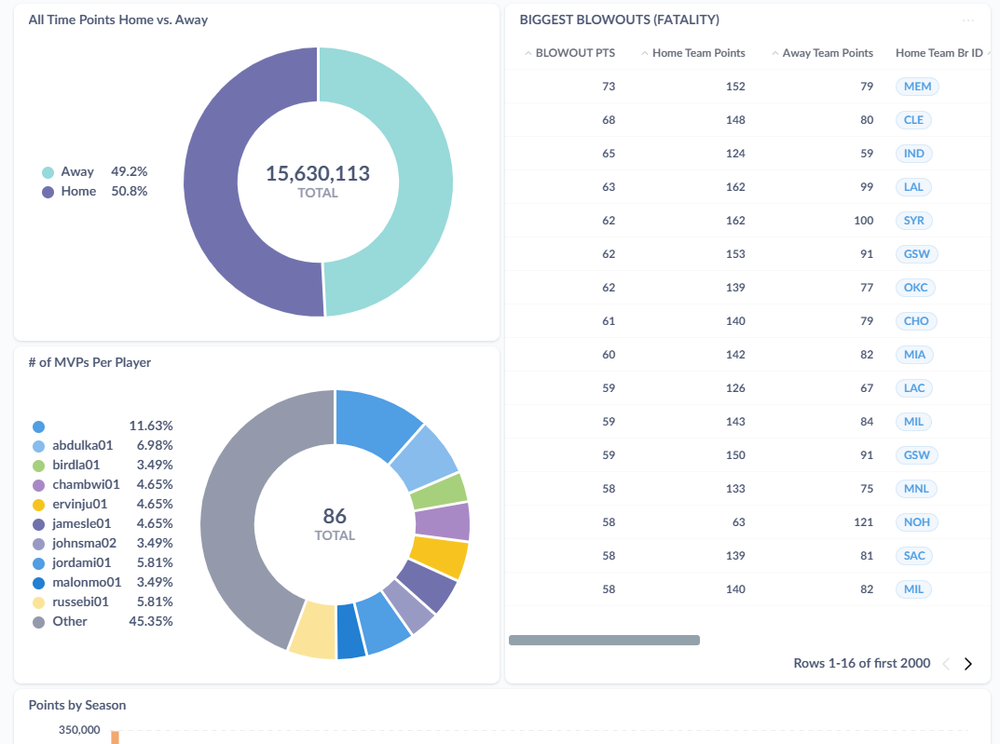

# STATBUCKET

Unlimited NBA Information!!

In any way ya like it.

This codebase scrapes basketball-reference.com and loads the data into a mariadb database and runs a metabase frontend for visualization.

## Project redesign

Although this project has scraped millions of rows, it is being redesigned to optimize scale and enhance functionality! See the new repo [here](https://github.com/JudahWilson/StatBucket-2.0)

## Installation

- uv sync
- uv run py main.py --install-completion

## Note

- Recently basketball-reference.com has added bot detection that necessitates the use of a browser engine (like playwright or selenium). The new codebase accommodates this change with playwright.

## Usage (until refactored)
### Download html for ot for teams between 2000-2005
`python bucket.py hunt pgs html -s 2000-2005`

### process html to json for ot for teams between 2000-2005
`python bucket.py hunt pgs html -s 2000-2005`

### django app
Coming Soon: reference statbucketdj/README.md for migration of row data in addition to table schema migration